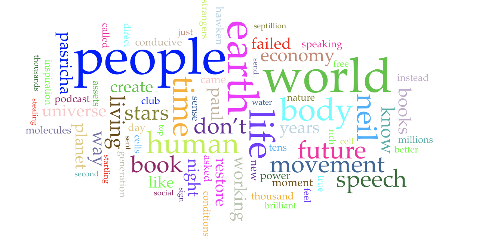



Link to speech:
https://www.neil.blog/full-speech-transcript/you-are-brilliant-and-the-earth-is-hiring-by-paul-hawken

# Distant Reading Assignment 

Voyant results:

From the text, I can discern the most repeated words that appear, the main word being “people”, which appeared 14 times.  It shows how many words appear per sentence, the sentences that the words appear in, and gives a visual on where the words appear in the text.  However, I can’t grasp the main points from the speech, the meaning – unless I read the ‘reader’ section at the top – and I can’t understand how it was supposed to flow.  The results are accurate, as it gives the evidence of where the words appear.  Additionally, it wasn’t giving an analysis of the meaning of the text but rather analyzed the patterns inside the text (with evidence) and therefore was accurate for that purpose.

CoPilot response:

🔹 Summary
This speech is a passionate address to a graduating class, urging them to take responsibility for the planet and humanity’s future. It blends environmental urgency with poetic reflection, historical context, and a call for collective action. The speaker emphasizes interconnectedness, the need for a new societal “operating system,” and the importance of hope, creativity, and courage in the face of global challenges.

🔹 Key Points & Themes
Environmental Crisis & Urgency

Every living system on Earth is in decline, and the rate is accelerating.
Civilization needs a new operating system, and the graduates are the programmers.
Call to Action

The Earth is “hiring” — it needs people to restore and protect it.
Don’t be discouraged by what seems impossible; act first, assess later.
Hope Through Collective Effort

Despite grim data, optimism is found in the people working to restore the planet.
Millions are engaged in efforts across sectors — NGOs, nonprofits, schools, farms, etc.
Historical Inspiration

The abolitionist movement is cited as an example of people organizing for justice without personal gain.
Today’s global movement for environmental and social justice is even larger.
Interconnectedness of Life

The speech explores biological interconnectedness, emphasizing that life is a miracle.
Our bodies are communities of cells and microorganisms working in harmony.
Spiritual & Philosophical Reflections

References to poets, philosophers, and religious teachings underscore the sacredness of life.
The stars, nature, and everyday miracles are reminders of beauty and purpose.
Empowerment & Responsibility

The graduates are entrusted with the most significant challenge of any generation.
Cynicism is rejected in favor of hope, imagination, and action.

